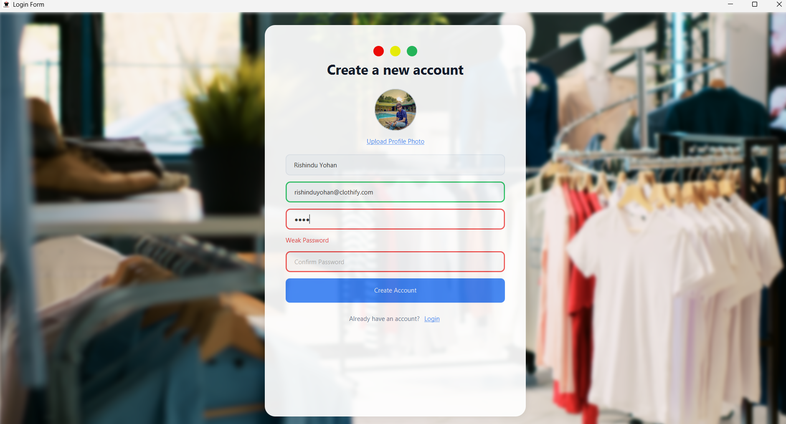
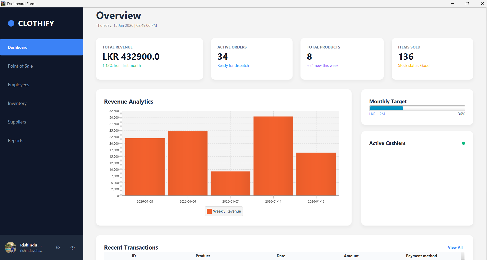
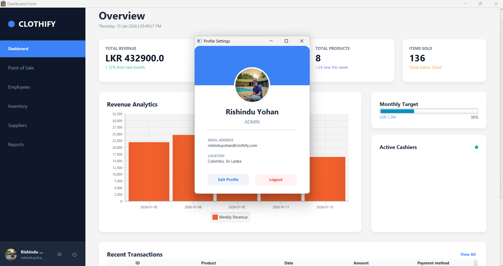
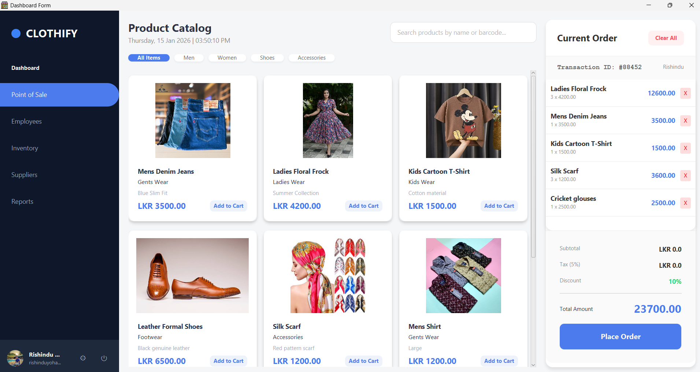
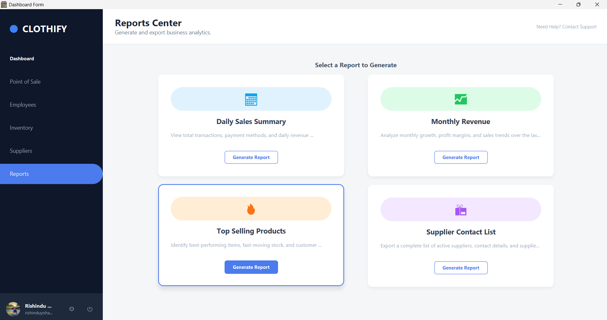
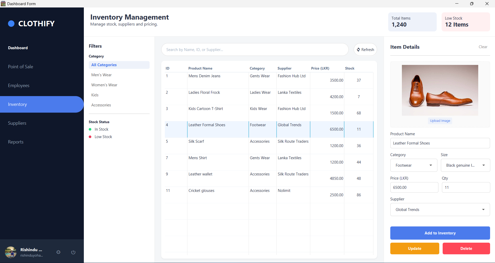

# Clothify Store POS System

> 📌 *A modern Point-of-Sale(POS) system for clothing stores manage inventory, sales, staff, and more with ease.*

---

<!-- #### 🏷️ Badges (optional) -->
<!-- Add CI/Build/License badges here if you have them -->
<!-- Example: -->
<!--  -->

---

## 📌 Overview

**Clothify Store POS System** is a Java-based desktop application designed to help clothing retail stores manage daily store operations including sales, inventory, staff, suppliers, reporting, and secure user authentication easily.  
Built using modern technologies, the system is user-friendly and aimed at improving workflow efficiency and accuracy.

---

## 🖼️ Screenshots

> *Add your screenshots here to show UI views, dashboards, and features (replace image paths below).*

| Sign Up Screen | Dashboard |
|---------------|-----------|
|  |  |

| Profile | Sales View |
|--------|----------------|
|  |  |

| Report Generation | Inventory      |
|------------------|---------------------|
|  |     |


---

## 🚀 Features

✔️ User Authentication (admin & staff login)  
✔️ Inventory & Product Management  
✔️ Sales & POS Processing  
✔️ Supplier & Staff Management  
✔️ Order History & Reporting  
✔️ Discounts & Totals Calculation  
✔️ Search & Filtering  
✔️ Secure Data Handling  
✔️ Modular & Extensible Architecture

*Features inspired by similar POS projects and standard retail requirements.* :contentReference[oaicite:0]{index=0}

---

## 🛠️ Tech Stack

| Layer | Technology |
|-------|------------|
| Frontend UI | JavaFX (JFoenix) |
| Backend | Java (Spring Boot / Plain Java / MVC) |
| Database | MySQL |
| Build Tool | Maven |
| Security | Encryption for sensitive data |
| Packaging | Launch4j (Optional for Windows .exe) |

> *Update this list to match your actual stack.*

---

## 📥 Prerequisites

Before running the project locally, install:

- Java JDK 11 or higher
- Maven
- MySQL (or compatible database)
- Optional: Launch4j (for packaging executable)

---

## 💾 Database Setup

1. Create a new MySQL database (e.g., `clothify_pos_db`).
2. Import your SQL schema file (if available).
3. Update database credentials in:
4. `src/main/resources/application.properties`:

```properties


spring.datasource.url=jdbc:mysql://localhost:3306/clothify_pos_db
spring.datasource.username=root
spring.datasource.password=yourpassword

```
---

## 📦 Installation & Running

### Clone the Repository

```bash
git clone https://github.com/rishinduyohan/clothify-store-pos-system.git
cd clothify-store-pos-system
```
### Run using IDE
Open the project in IntelliJ / Eclipse
Build & run the Main class (or Spring Boot application class)
### Run via Maven

```bash
mvn clean install
mvn spring-boot:run
```